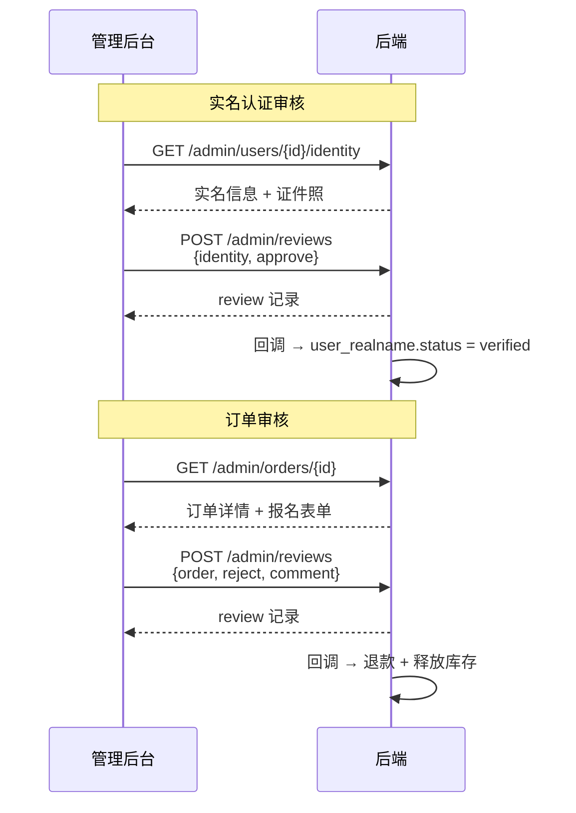

# 后台前端跟进事项

> 后端订单系统重构 + 审核系统上线后，管理后台前端需配合的改动。

---

## 1. 订单管理页面

### 1.1 列表接口

**接口**: `GET /admin/orders`

| 改动项 | 之前 | 之后 |
|--------|------|------|
| 筛选参数 | `?cert_type=H3C-NE` | `?product_type=H3C-NE` |
| 列表字段 | `item.cert_type` | `item.product_type` |
| 列名 | 「认证类型」 | 「商品类型」 |
| 新增字段 | — | `item.order_kind`（`"certification"` / `"course"`） |
| 新增展示 | — | 「课程」/「认证报名」标签 |
| 考生姓名 | `item.candidate_name` 必返回 | 可能为 `null`（课程订单无考生） |
| 考生手机 | `item.candidate_phone` 必返回 | 可能为 `null` |

**改动量**: 字段名全局替换 + 新增 `order_kind` 标签列，约 10 行。

### 1.2 导出接口

**接口**: `GET /admin/orders/export`

筛选参数 `cert_type` → `product_type`，CSV 列名同步。

---

## 2. 审核操作

### 2.1 统一审核接口

旧接口全部保留，可逐页面切流。

**新接口**: `POST /admin/reviews`

```json
{
    "target_type": "identity | student | enterprise | order",
    "target_id": 123,
    "action": "approve | reject",
    "comment": "驳回理由"
}
```

### 2.2 各页面映射

| 页面 | 旧接口 | 新接口请求体 |
|------|--------|------------|
| 用户详情 — 实名审核通过 | `PUT /admin/users/{id}/identity/review` | `{target_type:"identity", target_id: uid, action:"approve"}` |
| 用户详情 — 实名驳回 | 同上 | `{target_type:"identity", target_id: uid, action:"reject", comment:"理由"}` |
| 用户详情 — 学生审核 | `PUT /admin/users/{id}/student/review` | `{target_type:"student", ...}` |
| 用户详情 — 企业审核 | `PUT /admin/users/{id}/enterprise/review` | `{target_type:"enterprise", ...}` |
| 订单详情 — 审核通过 | `PUT /admin/orders/{id}/review` | `{target_type:"order", target_id: oid, action:"approve"}` |
| 订单详情 — 驳回并退款 | 同上 | `{target_type:"order", target_id: oid, action:"reject", comment:"理由"}` |

> ⚠️ 旧接口的「驳回报名信息」（不退款）在新审核系统中暂未实现，如需保留请继续使用旧接口。

**改动量**: 每个审核按钮约 5 行，改 URL + 请求体格式。

### 2.3 审核效果对照

| target_type | action=approve | action=reject |
|-------------|---------------|---------------|
| `identity` | 实名认证通过 | 实名驳回，恢复旧值 |
| `student` | 学生信息通过 | 学生信息驳回，恢复旧值 |
| `enterprise` | 企业信息通过 | 企业信息驳回，恢复旧值 |
| `order` | 订单完成 `paid→completed` | 退款 + 释放库存 `paid→refunded` |

---

## 3. 审核记录（可选）

**接口**: `GET /admin/reviews`

| 参数 | 说明 |
|------|------|
| `target_type` | 按审核对象类型筛选 |
| `target_id` | 按审核对象 ID 筛选 |
| `page` / `page_size` | 分页 |

**用途**: 在用户详情/订单详情页展示审核历史时间线。

---

## 4. 改动汇总

| 页面 | 改动项 | 紧迫度 | 量 |
|------|--------|:---:|-----|
| 订单列表 | 字段名 `cert_type`→`product_type`，加 `order_kind` 标签 | P1 | ~10 行 |
| 订单导出 | 参数名同步 | P1 | ~2 行 |
| 用户详情 — 审核按钮 | 切 `POST /admin/reviews`（可选，旧接口仍可用） | P2 | ~5 行 × 3 |
| 订单详情 — 审核按钮 | 切 `POST /admin/reviews`（可选，旧接口仍可用） | P2 | ~5 行 |
| 审核记录 | 新建审核历史组件 | P3 | 按需 |

---

## 5. 测试用 Admin Token

```bash
curl -s -X POST http://127.0.0.1:8000/admin/auth/login \
  -H 'Content-Type: application/json' \
  -d '{"username":"admin","password":"admin123"}'
```

审核接口需要 `user:write` 权限（`super_admin` 角色自带）。

---

## 6. 审核管理页调用流程

### 6.0 架构原则

**审核系统不聚合数据**。待审核列表和内容查看复用现有接口，审核系统只管两件事：
- `POST /admin/reviews` — 提交审核
- `GET  /admin/reviews` — 查审核历史

### 6.1 待审核列表入口

```
实名待审:  GET /admin/users?identity_status=pending
学生待审:  GET /admin/users?student_status=pending
企业待审:  GET /admin/users?enterprise_status=pending
订单待审:  GET /admin/orders?status=paid
```

前端在审核管理页可并行发 4 个请求，按 `target_type` 分类展示。

### 6.2 总览

```
管理员进入审核页
      │
      ├─ GET /admin/users?identity_status=pending    实名待审列表
      ├─ GET /admin/users?student_status=pending     学生待审列表
      ├─ GET /admin/users?enterprise_status=pending  企业待审列表
      ├─ GET /admin/orders?status=paid               订单待审列表
      │
      ├─ 点击某项 → GET /admin/users/{id}/identity|student|enterprise
      │            或 GET /admin/orders/{id}  查看内容
      │
      ├─ 通过/驳回 → POST /admin/reviews
      │
      └─ GET /admin/reviews?target_type=&target_id=  审核历史
```

### 6.3 按 target_type 的完整调用

#### 实名认证审核

```
1. GET /admin/users/{user_id}/identity
   → 返回: real_name, id_card_number(明文), id_card_front_oss,
            id_card_back_oss, status

2. 管理员查看身份证照片 → 决定通过/驳回

3. POST /admin/reviews
   { "target_type": "identity", "target_id": 338, "action": "approve" }
   或
   { "target_type": "identity", "target_id": 338, "action": "reject", "comment": "照片不清晰" }

4. (可选) GET /admin/reviews?target_type=identity&target_id=338
   → 查看该用户的审核历史时间线
```

#### 学生信息审核

```
1. GET /admin/users/{user_id}/student
   → 返回: 学生证信息 + status

2. POST /admin/reviews
   { "target_type": "student", "target_id": uid, "action": "approve" }
```

#### 企业信息审核

```
1. GET /admin/users/{user_id}/enterprise
   → 返回: 企业信息 + status

2. POST /admin/reviews
   { "target_type": "enterprise", "target_id": uid, "action": "approve" }
```

#### 订单审核

```
1. GET /admin/orders/{order_id}
   → 返回: order_kind, product_type, candidate_*, price,
            status, extra_data(报名表单)

2. POST /admin/reviews
   { "target_type": "order", "target_id": 170, "action": "approve" }
   或
   { "target_type": "order", "target_id": 170, "action": "reject", "comment": "身份证模糊" }

3. 驳回后订单自动退款 + 释放库存 → 用户可重新报名
```

### 6.4 各 target_type 对应的详情接口

| target_type | 详情接口 | 返回关键字段 |
|-------------|---------|------------|
| `identity` | `GET /admin/users/{id}/identity` | `real_name`, `id_card_number`(明文), `id_card_front_oss`, `id_card_back_oss`, `status` |
| `student` | `GET /admin/users/{id}/student` | 学生证信息 + `status` |
| `enterprise` | `GET /admin/users/{id}/enterprise` | 企业信息 + `status` |
| `order` | `GET /admin/orders/{id}` | `order_kind`, `product_type`, `candidate_*`, `price`, `status`, `extra_data` |

### 6.5 调用时序



### 6.6 前端伪代码

```javascript
// 审核提交
async function submitReview(targetType, targetId, action, comment) {
  const resp = await fetch('/admin/reviews', {
    method: 'POST',
    headers: {
      'Authorization': `Bearer ${adminToken}`,
      'Content-Type': 'application/json',
    },
    body: JSON.stringify({
      target_type: targetType,   // "identity" | "student" | "enterprise" | "order"
      target_id: targetId,
      action: action,            // "approve" | "reject"
      comment: comment || null,
    }),
  });
  const { code, data } = await resp.json();
  if (code === 0) {
    // 审核成功 — data.id 为审核记录 ID
    // 刷新详情页以显示新状态
  }
}

// 审核历史
async function fetchReviewHistory(targetType, targetId) {
  const params = new URLSearchParams({ target_type: targetType, target_id: targetId });
  const resp = await fetch(`/admin/reviews?${params}`, {
    headers: { 'Authorization': `Bearer ${adminToken}` },
  });
  const { data } = await resp.json();
  return data.items; // [{ id, action, comment, reviewer_id, created_at }, ...]
}
```
