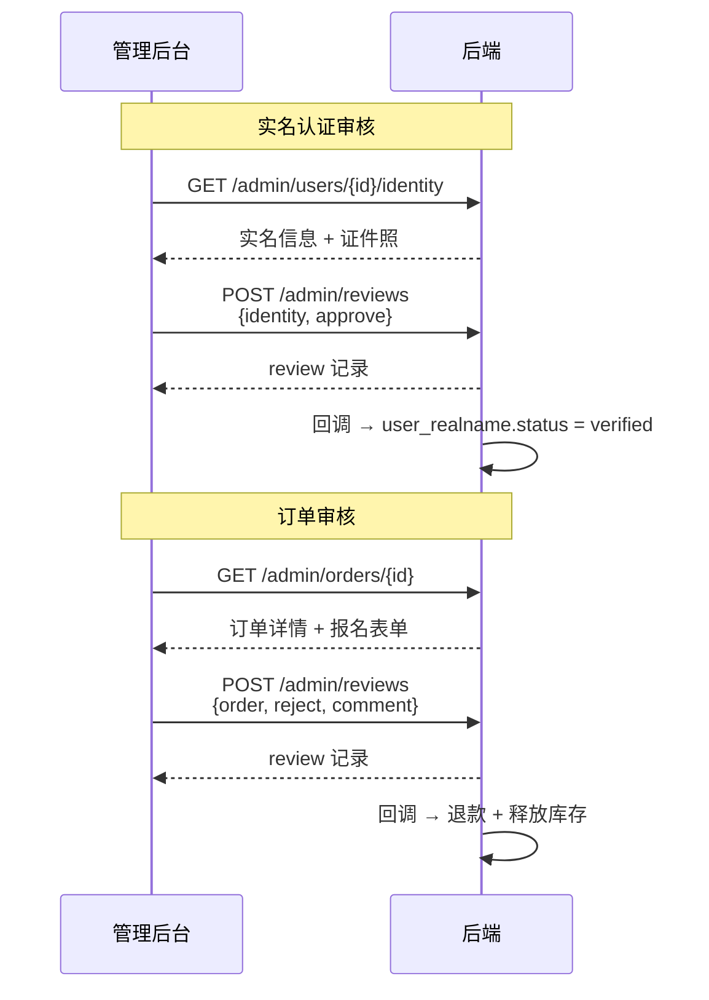

# 后台前端跟进事项

> 后端订单系统重构 + 审核系统上线后，管理后台前端需配合的改动。

---

## 1. 订单管理页面

### 1.1 列表接口

**接口**: `GET /admin/orders`

| 改动项 | 之前 | 之后 |
|--------|------|------|
| 筛选参数 | `?cert_type=H3C-NE` | `?product_type=H3C-NE` |
| 列表字段 | `item.cert_type` | `item.product_type` |
| 列名 | 「认证类型」 | 「商品类型」 |
| 新增字段 | — | `item.order_kind`（`"certification"` / `"course"`） |
| 新增展示 | — | 「课程」/「认证报名」标签 |
| 考生姓名 | `item.candidate_name` 必返回 | 可能为 `null`（课程订单无考生） |
| 考生手机 | `item.candidate_phone` 必返回 | 可能为 `null` |

**改动量**: 字段名全局替换 + 新增 `order_kind` 标签列，约 10 行。

### 1.2 导出接口

**接口**: `GET /admin/orders/export`

筛选参数 `cert_type` → `product_type`，CSV 列名同步。

---

## 2. 审核操作

### 2.1 统一审核接口

旧接口全部保留，可逐页面切流。

**新接口**: `POST /admin/reviews`

```json
{
    "target_type": "identity | student | enterprise | order",
    "target_id": 123,
    "action": "approve | reject",
    "comment": "驳回理由"
}
```

### 2.2 各页面映射

| 页面 | 旧接口 | 新接口请求体 |
|------|--------|------------|
| 用户详情 — 实名审核通过 | `PUT /admin/users/{id}/identity/review` | `{target_type:"identity", target_id: uid, action:"approve"}` |
| 用户详情 — 实名驳回 | 同上 | `{target_type:"identity", target_id: uid, action:"reject", comment:"理由"}` |
| 用户详情 — 学生审核 | `PUT /admin/users/{id}/student/review` | `{target_type:"student", ...}` |
| 用户详情 — 企业审核 | `PUT /admin/users/{id}/enterprise/review` | `{target_type:"enterprise", ...}` |
| 订单详情 — 审核通过 | `PUT /admin/orders/{id}/review` | `{target_type:"order", target_id: oid, action:"approve"}` |
| 订单详情 — 驳回并退款 | 同上 | `{target_type:"order", target_id: oid, action:"reject", comment:"理由"}` |

> ⚠️ 旧接口的「驳回报名信息」（不退款）在新审核系统中暂未实现，如需保留请继续使用旧接口。

**改动量**: 每个审核按钮约 5 行，改 URL + 请求体格式。

### 2.3 审核效果对照

| target_type | action=approve | action=reject |
|-------------|---------------|---------------|
| `identity` | 实名认证通过 | 实名驳回，恢复旧值 |
| `student` | 学生信息通过 | 学生信息驳回，恢复旧值 |
| `enterprise` | 企业信息通过 | 企业信息驳回，恢复旧值 |
| `order` | 订单完成 `paid→completed` | 退款 + 释放库存 `paid→refunded` |

---

## 3. 审核记录（可选）

**接口**: `GET /admin/reviews`

| 参数 | 说明 |
|------|------|
| `target_type` | 按审核对象类型筛选 |
| `target_id` | 按审核对象 ID 筛选 |
| `page` / `page_size` | 分页 |

**用途**: 在用户详情/订单详情页展示审核历史时间线。

---

## 4. 改动汇总

| 页面 | 改动项 | 紧迫度 | 量 |
|------|--------|:---:|-----|
| 订单列表 | 字段名 `cert_type`→`product_type`，加 `order_kind` 标签 | P1 | ~10 行 |
| 订单导出 | 参数名同步 | P1 | ~2 行 |
| 用户详情 — 审核按钮 | 切 `POST /admin/reviews`（可选，旧接口仍可用） | P2 | ~5 行 × 3 |
| 订单详情 — 审核按钮 | 切 `POST /admin/reviews`（可选，旧接口仍可用） | P2 | ~5 行 |
| 审核记录 | 新建审核历史组件 | P3 | 按需 |

---

## 5. 测试用 Admin Token

```bash
curl -s -X POST http://127.0.0.1:8000/admin/auth/login \
  -H 'Content-Type: application/json' \
  -d '{"username":"admin","password":"admin123"}'
```

审核接口需要 `user:write` 权限（`super_admin` 角色自带）。

---

## 6. 审核管理页调用流程

### 6.0 架构原则

**审核系统不聚合数据**。待审核列表和内容查看复用现有接口，审核系统只管两件事：
- `POST /admin/reviews` — 提交审核
- `GET  /admin/reviews` — 查审核历史

### 6.1 待审核列表入口

```
实名待审:  GET /admin/users?identity_status=pending
学生待审:  GET /admin/users?student_status=pending
企业待审:  GET /admin/users?enterprise_status=pending
订单待审:  GET /admin/orders?status=paid
```

前端在审核管理页可并行发 4 个请求，按 `target_type` 分类展示。

### 6.2 总览

```
管理员进入审核页
      │
      ├─ GET /admin/users?identity_status=pending    实名待审列表
      ├─ GET /admin/users?student_status=pending     学生待审列表
      ├─ GET /admin/users?enterprise_status=pending  企业待审列表
      ├─ GET /admin/orders?status=paid               订单待审列表
      │
      ├─ 点击某项 → GET /admin/users/{id}/identity|student|enterprise
      │            或 GET /admin/orders/{id}  查看内容
      │
      ├─ 通过/驳回 → POST /admin/reviews
      │
      └─ GET /admin/reviews?target_type=&target_id=  审核历史
```

### 6.3 按 target_type 的完整调用

#### 实名认证审核

```
1. GET /admin/users/{user_id}/identity
   → 返回: real_name, id_card_number(明文), id_card_front_oss,
            id_card_back_oss, status

2. 管理员查看身份证照片 → 决定通过/驳回

3. POST /admin/reviews
   { "target_type": "identity", "target_id": 338, "action": "approve" }
   或
   { "target_type": "identity", "target_id": 338, "action": "reject", "comment": "照片不清晰" }

4. (可选) GET /admin/reviews?target_type=identity&target_id=338
   → 查看该用户的审核历史时间线
```

#### 学生信息审核

```
1. GET /admin/users/{user_id}/student
   → 返回: 学生证信息 + status

2. POST /admin/reviews
   { "target_type": "student", "target_id": uid, "action": "approve" }
```

#### 企业信息审核

```
1. GET /admin/users/{user_id}/enterprise
   → 返回: 企业信息 + status

2. POST /admin/reviews
   { "target_type": "enterprise", "target_id": uid, "action": "approve" }
```

#### 订单审核

```
1. GET /admin/orders/{order_id}
   → 返回: order_kind, product_type, candidate_*, price,
            status, extra_data(报名表单)

2. POST /admin/reviews
   { "target_type": "order", "target_id": 170, "action": "approve" }
   或
   { "target_type": "order", "target_id": 170, "action": "reject", "comment": "身份证模糊" }

3. 驳回后订单自动退款 + 释放库存 → 用户可重新报名
```

### 6.4 各 target_type 对应的详情接口

| target_type | 详情接口 | 返回关键字段 |
|-------------|---------|------------|
| `identity` | `GET /admin/users/{id}/identity` | `real_name`, `id_card_number`(明文), `id_card_front_oss`, `id_card_back_oss`, `status` |
| `student` | `GET /admin/users/{id}/student` | 学生证信息 + `status` |
| `enterprise` | `GET /admin/users/{id}/enterprise` | 企业信息 + `status` |
| `order` | `GET /admin/orders/{id}` | `order_kind`, `product_type`, `candidate_*`, `price`, `status`, `extra_data` |

### 6.5 调用时序



### 6.6 前端伪代码

```javascript
// 审核提交
async function submitReview(targetType, targetId, action, comment) {
  const resp = await fetch('/admin/reviews', {
    method: 'POST',
    headers: {
      'Authorization': `Bearer ${adminToken}`,
      'Content-Type': 'application/json',
    },
    body: JSON.stringify({
      target_type: targetType,   // "identity" | "student" | "enterprise" | "order"
      target_id: targetId,
      action: action,            // "approve" | "reject"
      comment: comment || null,
    }),
  });
  const { code, data } = await resp.json();
  if (code === 0) {
    // 审核成功 — data.id 为审核记录 ID
    // 刷新详情页以显示新状态
  }
}

// 审核历史
async function fetchReviewHistory(targetType, targetId) {
  const params = new URLSearchParams({ target_type: targetType, target_id: targetId });
  const resp = await fetch(`/admin/reviews?${params}`, {
    headers: { 'Authorization': `Bearer ${adminToken}` },
  });
  const { data } = await resp.json();
  return data.items; // [{ id, action, comment, reviewer_id, created_at }, ...]
}
```

---

## 7. 课程购买与资源管理跟进

> 当前状态：后端接口已完成，管理后台前端尚未接入。本节可直接作为后台前端开发与验收依据。

### 7.1 页面范围

后台需要补充以下功能：

1. 在课程管理下增加“购买记录”页面，用于查询报名、关联订单及学习权限状态。
2. 在购买记录中增加“撤销学习权限”操作。
3. 在课程详情或编辑页增加“课程资源”页签，用于上传、查看和删除私有课程资源。
4. 退款仍从订单管理发起，撤权不能代替退款。

建议页面结构：

```text
课程管理
├── 课程列表
│   └── 课程详情 / 编辑
│       └── 课程资源
└── 购买记录
```

### 7.2 课程购买记录

#### 接口

```http
GET /admin/courses/enrollments
Authorization: Bearer <admin_token>
```

权限要求：`course:list`

查询参数：

| 参数 | 类型 | 必填 | 说明 |
|------|------|------|------|
| `course_id` | integer | 否 | 按课程 ID 筛选 |
| `user_id` | integer | 否 | 按用户 ID 筛选 |
| `status` | string | 否 | 按报名状态筛选 |
| `page` | integer | 否 | 页码，默认 `1` |
| `page_size` | integer | 否 | 每页数量，默认 `20`，最大 `100` |

`status` 可选值：

- `pending_payment`：待支付
- `enrolled`：学习中
- `completed`：已完成
- `refunded`：已退款
- `cancelled`：已取消或人工撤权
- `expired`：已过期

列表至少展示以下字段：

| 字段 | 展示建议 |
|------|----------|
| `id` | 报名记录 ID |
| `user_id` | 用户 ID；当前接口暂不返回姓名和手机号 |
| `course_id` / `course_title` | 课程 ID、课程名称 |
| `order_id` | 订单 ID；免费课程可能为空 |
| `order_status` | 订单状态；免费课程可能为空 |
| `order_price` | 下单金额，单位沿用后端订单金额单位 |
| `batch_selected` | 用户选择的课程批次，可能为空 |
| `status` | 报名状态标签 |
| `learning_access` | 当前是否允许访问课程内容 |
| `access_granted_at` | 权限开通时间 |
| `access_revoked_at` | 权限撤销时间 |
| `created_at` | 报名创建时间 |

交互要求：

- 支持课程、用户 ID、报名状态筛选，并支持分页。
- `learning_access=true` 显示“可学习”，否则显示“无权限”。不要只根据报名状态推断权限。
- 有 `order_id` 时可提供“查看订单”入口，跳转到对应订单详情。
- 免费课程的 `order_id`、`order_status`、`order_price` 为空属于正常情况。
- 筛选条件变化后回到第 1 页。

### 7.3 手动撤销学习权限

#### 接口

```http
POST /admin/courses/enrollments/{enrollment_id}/revoke
Authorization: Bearer <admin_token>
```

权限要求：`course:write`

前端按钮显示条件：

```javascript
const canRevoke =
  ['enrolled', 'completed'].includes(record.status) &&
  record.learning_access === true;
```

操作要求：

1. 点击后必须二次确认，提示“撤权后用户将立即无法访问课程内容”。
2. 确认后调用撤权接口，成功后刷新当前列表或用响应数据更新该行。
3. 有效报名撤权后，报名状态变为 `cancelled`、`learning_access=false`，并记录 `access_revoked_at`。
4. `pending_payment` 不允许撤权，后端也会拒绝该操作。
5. 撤权只处理课程访问权限，不发起退款，也不修改关联订单状态。
6. 已退款、已取消或已经无权限的记录不显示撤权按钮。

退款必须走订单接口：

```http
POST /admin/orders/{order_id}/refund
Authorization: Bearer <admin_token>
```

权限要求：`order:write`

退款成功后，后端会同步把课程报名改为 `refunded` 并立即撤销学习权限。前端应刷新购买记录，不要再额外调用手动撤权接口。

建议确认文案：

```text
确认撤销该用户的课程学习权限？
撤权后用户将立即无法访问课程内容。本操作不会退款，如需退款请前往订单管理处理。
```

### 7.4 私有课程资源管理

建议在课程详情或编辑页增加“课程资源”页签，仅在课程已创建并取得 `course_id` 后显示。

#### 获取资源列表

```http
GET /admin/courses/{course_id}/assets
Authorization: Bearer <admin_token>
```

权限要求：`course:list`

响应项字段：

| 字段 | 说明 |
|------|------|
| `id` | 资源 ID |
| `course_id` | 所属课程 ID |
| `title` | 资源标题 |
| `storage_key` | 私有存储标识，仅用于后台展示或排查 |
| `asset_type` | 资源类型 |
| `sort_order` | 排序值，越小越靠前 |
| `is_preview` | 是否允许未购买用户试看 |
| `created_at` | 创建时间 |

#### 上传资源

```http
POST /admin/courses/{course_id}/assets
Content-Type: multipart/form-data
Authorization: Bearer <admin_token>
```

权限要求：`course:write`

表单字段：

| 字段 | 类型 | 必填 | 说明 |
|------|------|------|------|
| `file` | file | 是 | 要上传的视频或文件 |
| `title` | string | 是 | 资源标题，最长 256 字符 |
| `asset_type` | string | 是 | 资源类型，最长 32 字符 |
| `sort_order` | integer | 否 | 非负整数，默认 `0` |
| `is_preview` | boolean | 否 | 是否为试看资源，默认 `false` |

上传要求：

- 使用 `FormData` 提交，不能手动设置 multipart boundary。
- 显示上传中状态；上传期间禁用重复提交。
- 上传失败时保留用户已填写的标题、类型、排序和试看设置。
- 上传成功后清空表单并刷新资源列表。
- `is_preview=true` 的资源在列表中显示醒目的“试看”标签。

#### 删除资源

```http
DELETE /admin/courses/{course_id}/assets/{asset_id}
Authorization: Bearer <admin_token>
```

权限要求：`course:write`

删除前必须二次确认；成功后刷新资源列表。删除会同时移除资源记录和私有文件，不能撤销。

### 7.5 资源安全约束

- 课程视频和文件是私有资源，后台不得拼接或持久化公共 `/api/media/{file_id}` 地址。
- 不要把 `storage_key` 当作可直接访问的 URL。
- 学员端播放或下载必须使用课程内容接口返回的受鉴权地址：

```http
GET /api/courses/{course_id}/content
GET /api/course-assets/{asset_id}/content
```

- 非试看资源由后端校验 `learning_access`；前端隐藏入口不能替代后端鉴权。
- 公开课程详情不应展示教师联系方式或旧的 `video_url`。

### 7.6 当前接口限制

以下能力本期后端尚未提供，后台前端不要自行模拟：

- 购买记录只返回 `user_id`，暂不返回用户姓名、昵称或手机号。
- 暂无资源编辑接口，上传后不能直接修改标题、类型、排序或试看状态。
- 暂无批量拖拽排序接口；当前排序值在上传时设置。
- 暂无手动开通或恢复学习权限接口。
- 暂无撤权原因、操作人及操作日志字段。
- 暂无资源在线预览专用后台接口。

需要以上能力时，应先补充后端接口和审计设计，不能通过直接修改报名状态或数据库实现。

### 7.7 验收清单

#### 购买记录与撤权（P1）

- [ ] 购买记录支持课程、用户 ID、状态筛选及分页。
- [ ] 免费课程、待支付课程、已支付课程的订单字段展示正确。
- [ ] 页面同时展示报名状态与实际学习权限状态。
- [ ] 仅有效且已开通权限的报名显示撤权按钮。
- [ ] 撤权前有明确的不可学习、不会退款提示。
- [ ] 撤权成功后状态变为 `cancelled`，权限变为“无权限”。
- [ ] 退款操作使用订单退款接口，退款后购买记录显示 `refunded` 且无学习权限。

#### 资源管理（P1）

- [ ] 可以按课程加载资源列表。
- [ ] 可以上传文件并设置标题、类型、排序和试看状态。
- [ ] 上传过程有 loading、重复提交保护和失败提示。
- [ ] 可以二次确认后删除资源，并正确刷新列表。
- [ ] 页面没有使用公共 `/api/media` 地址访问私有课程资源。

#### 后续增强（P2）

- [ ] 增加用户姓名、手机号等购买人信息。
- [ ] 增加资源编辑和拖拽排序。
- [ ] 增加撤权原因、操作人和审计日志。
- [ ] 根据业务确认是否需要手动恢复权限能力。
