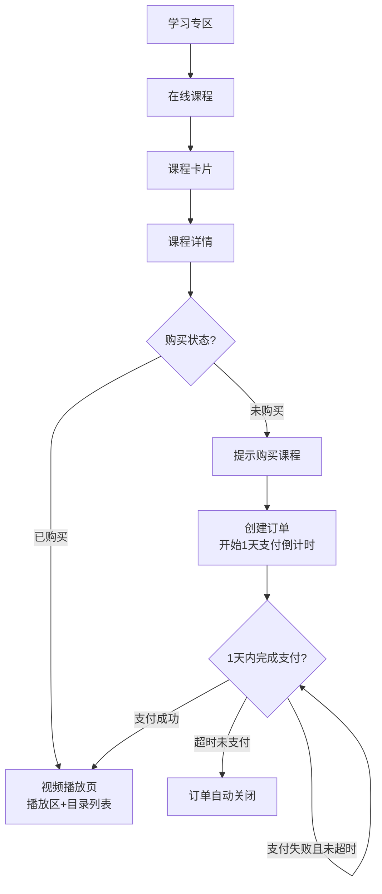

# 在线课程业务流程

```mermaid
flowchart TD
    A[学习专区] --> B[在线课程]
    B --> C[课程卡片]
    C --> D[课程详情]
    D --> E{购买状态?}
    E -->|已购买| F[视频播放页<br/>播放区+目录列表]
    E -->|未购买| G[提示购买课程]
    G --> H[创建订单<br/>开始1天支付倒计时]
    H --> I{1天内完成支付?}
    I -->|支付成功| F
    I -->|支付失败且未超时| I
    I -->|超时未支付| J[订单自动关闭]
```
