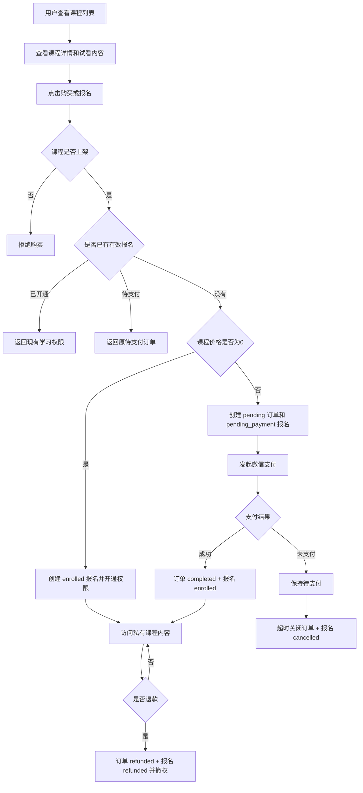
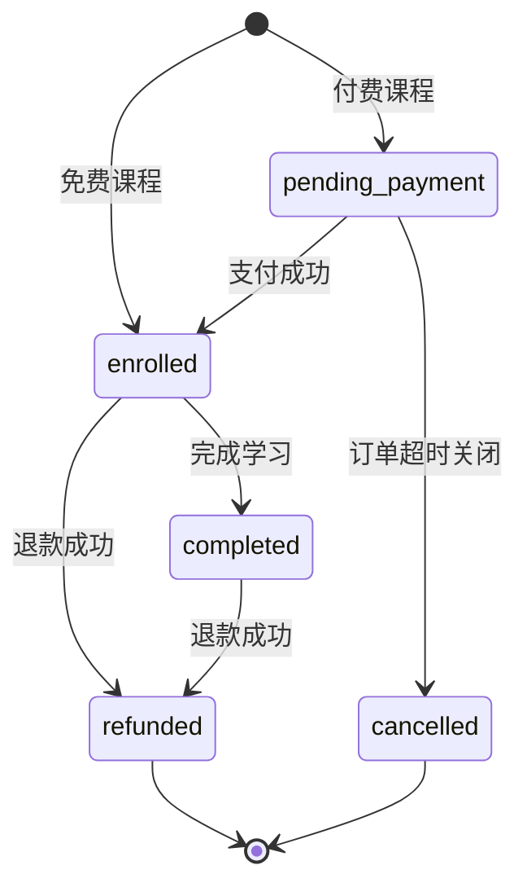

# 在线课程业务流程

## 核心规则

- 课程价格只读取后端 `Course.price`。
- 免费课程直接创建 `enrolled` 报名，不创建订单。
- 付费课程创建 `pending` 订单和 `pending_payment` 报名，支付前不得访问私有内容。
- 支付、退款、关单通过统一履约回调更新报名，并与订单状态在同一事务提交。
- 下架仅禁止新购买，已有学习权限不受影响。
- 课程资源存放在私有目录，通过资源接口逐次鉴权。

## 购买流程



## 报名状态



## 历史审计

迁移后运行以下命令导出历史付费课程报名及旧公开视频迁移清单：

```bash
python scripts/audit_legacy_paid_course_enrollments.py --output course-audit.csv
```
