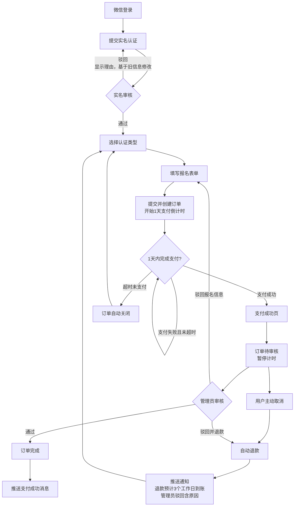
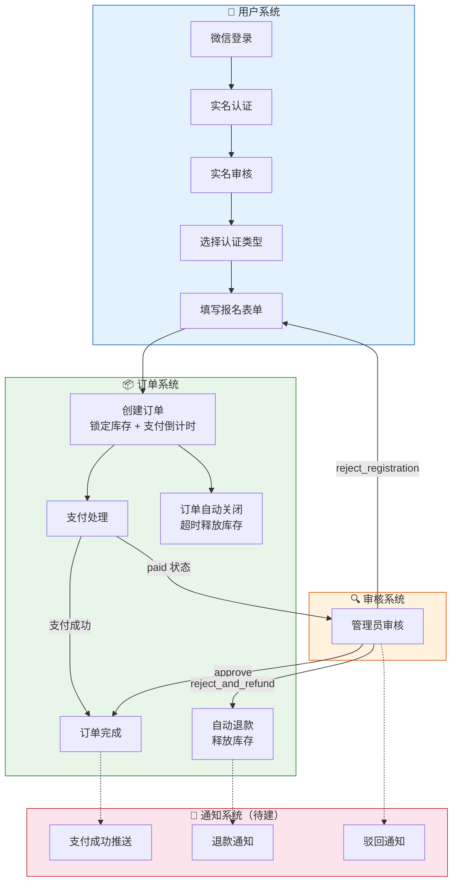

# 认证报名业务流程

## 业务流程图



## 模块边界视图



### 模块职责

| 模块 | 职责 | 不负责 |
|------|------|--------|
| 用户系统 | 登录、实名、表单填写 | 订单状态、支付 |
| 订单系统 | 库存、支付、状态流转、退款 | 审核决策（判断通过/驳回） |
| 审核系统 | 管理员审核决策、驳回理由 | 改订单状态、退款、释放库存 |
| 通知系统 | 推送消息 | 业务逻辑 |

### 模块间交互

```
用户系统 ──创建──→ 订单系统
订单系统 ──待审核──→ 审核系统
审核系统 ──approve──→ 订单系统（→ completed）
审核系统 ──reject──→ 用户系统（重新填写）/ 订单系统（退款）
订单系统 ──事件──→ 通知系统
```
