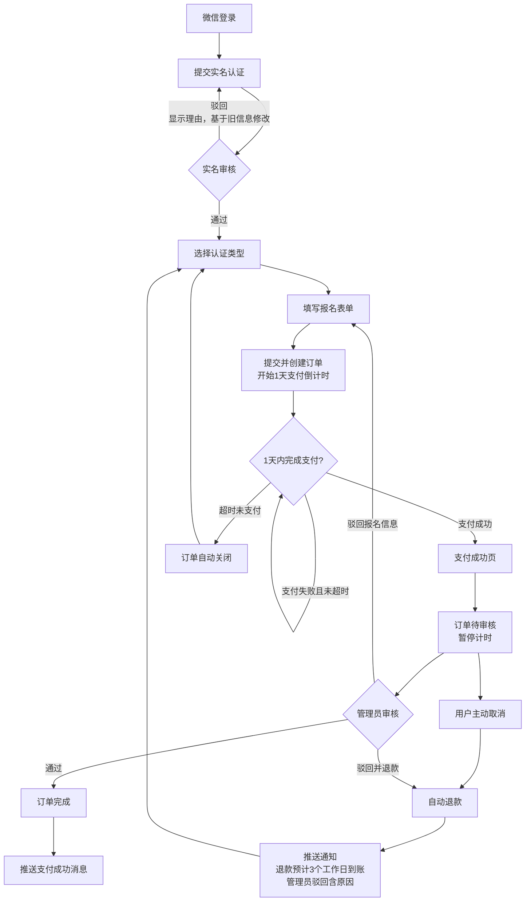

# 认证报名业务流程

```mermaid
flowchart TD
    A[微信登录] --> B[提交实名认证]
    B --> C{实名审核}
    C -->|驳回<br/>显示理由，基于旧信息修改| B
    C -->|通过| D[选择认证类型]
    D --> E[填写报名表单]
    E --> F[提交并创建订单<br/>开始1天支付倒计时]
    F --> G{1天内完成支付?}
    G -->|支付成功| P[支付成功页] --> I[订单待审核<br/>暂停计时]
    G -->|支付失败且未超时| G
    G -->|超时未支付| H[订单自动关闭] --> D
    I --> U[用户主动取消] --> L
    I --> J{管理员审核}
    J -->|通过| K[订单完成]
    J -->|驳回报名信息| E
    J -->|驳回并退款| L[自动退款]
    K --> M[推送支付成功消息]
    L --> N[推送通知<br/>退款预计3个工作日到账<br/>管理员驳回含原因]
    N --> D
```
