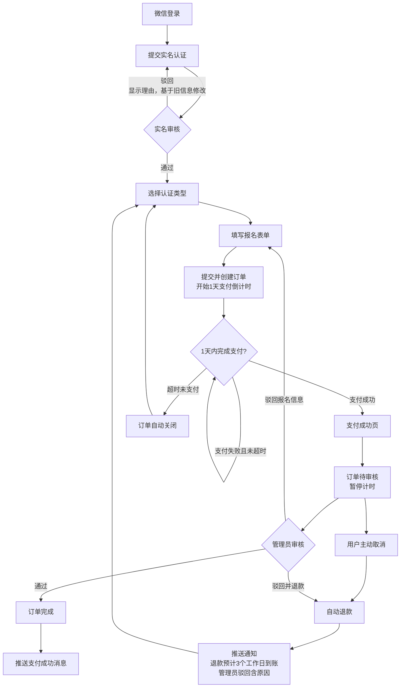
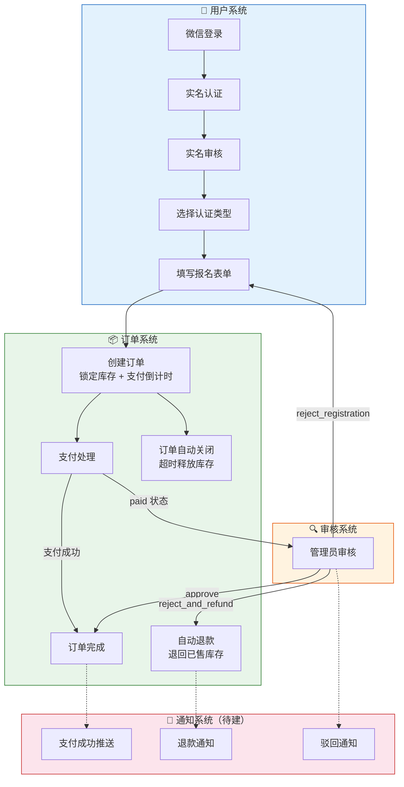
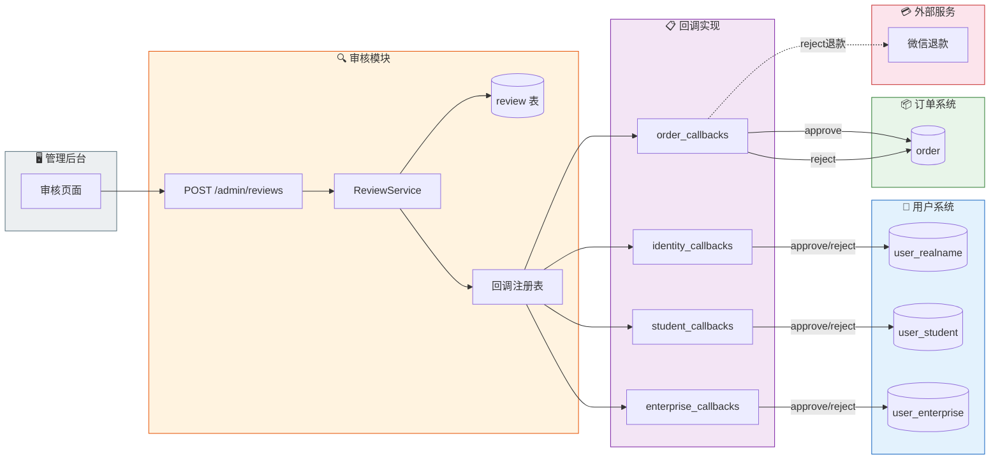
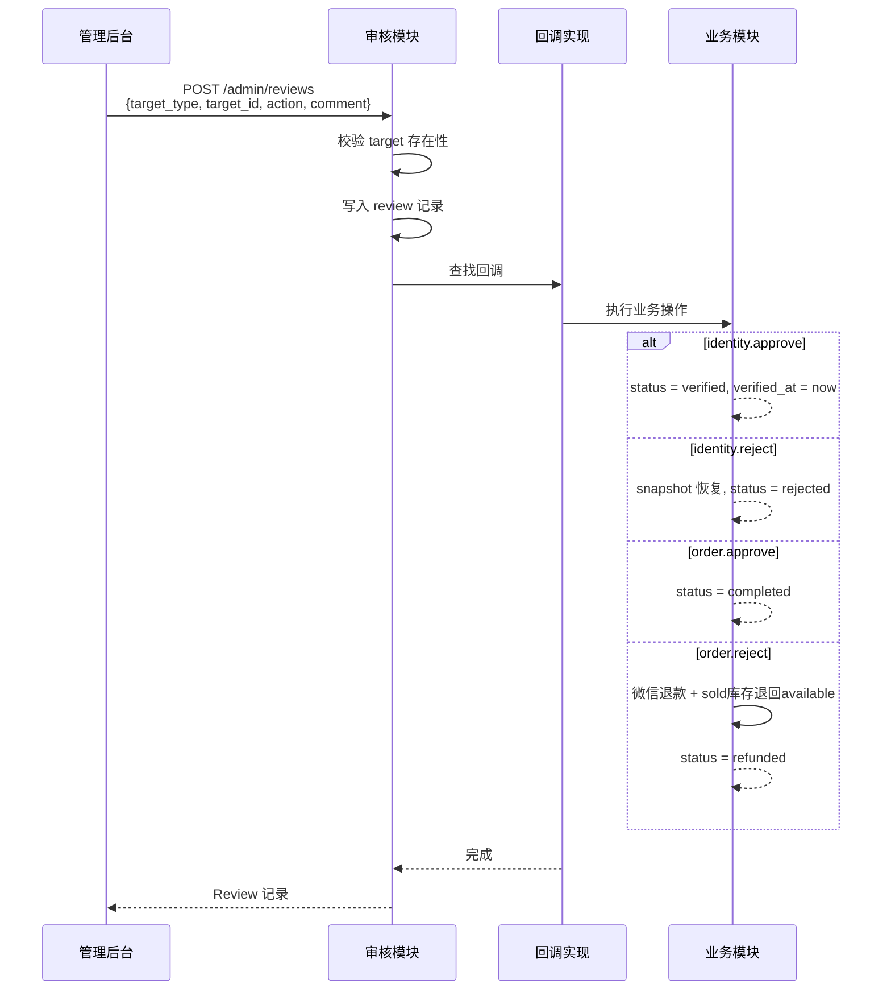

# 认证报名业务流程

## 业务流程图



## 模块边界视图



### 模块职责

| 模块 | 职责 | 不负责 |
|------|------|--------|
| 用户系统 | 登录、实名、表单填写 | 订单状态、支付 |
| 订单系统 | 库存、支付、状态流转、退款 | 审核决策（判断通过/驳回） |
| 审核系统 | 管理员审核决策、驳回理由 | 改订单状态、退款、释放库存 |
| 通知系统 | 推送消息 | 业务逻辑 |

### 模块间交互

```
用户系统 ──创建──→ 订单系统
订单系统 ──待审核──→ 审核系统
审核系统 ──approve──→ 订单系统（→ completed）
审核系统 ──reject──→ 用户系统（重新填写）/ 订单系统（退款）
订单系统 ──事件──→ 通知系统
```

---

## 审核模块架构



### 请求流转



### 回调注册表

| target_type | action | 回调 | 改动的表/服务 |
|-------------|--------|------|-------------|
| `identity` | `approve` | `identity_callbacks.approve` | `user_realname.status`, `verified_at` |
| `identity` | `reject` | `identity_callbacks.reject` | `user_realname` (snapshot 恢复) |
| `student` | `approve` | `student_callbacks.approve` | `user_student.status`, `verified_at` |
| `student` | `reject` | `student_callbacks.reject` | `user_student` (snapshot 恢复) |
| `enterprise` | `approve` | `enterprise_callbacks.approve` | `user_enterprise.status`, `verified_at` |
| `enterprise` | `reject` | `enterprise_callbacks.reject` | `user_enterprise` (snapshot 恢复) |
| `order` | `approve` | `order_callbacks.approve` | `order.status = completed` |
| `order` | `reject` | `order_callbacks.reject` | 微信退款, `order.status = refunded`, 已售库存退回可用库存 |

### 关键约束

1. **审核模块不 import 业务模块** — 回调通过注册表注入，编译期无依赖
2. **回调幂等** — 同一审核记录不应重复执行业务操作
3. **回调失败不影响审核记录** — 审核已写入，回调失败重试或人工介入
